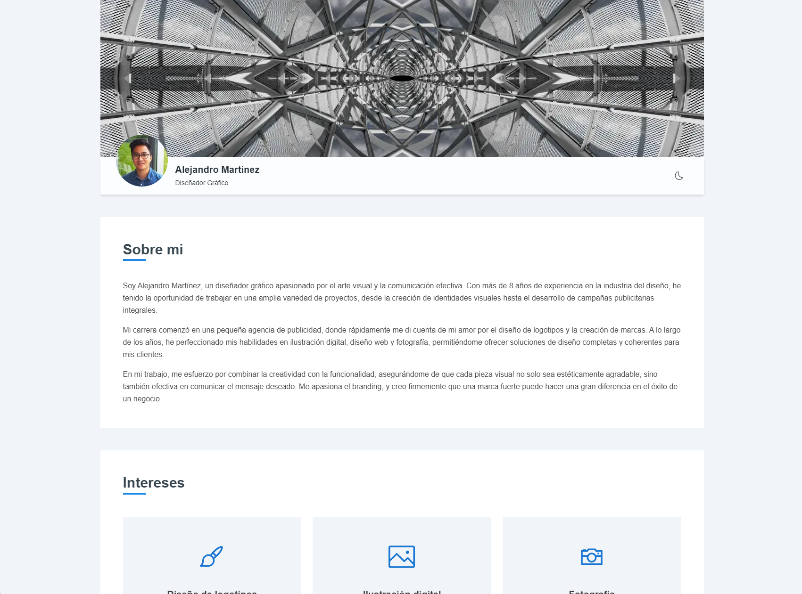

# User Profile Page




## Description

This is a web application developed using Next.js, designed to showcase a user profile. The application includes basic user information, a list of interests, and a contact section. It uses React, Tailwind CSS, and Material Tailwind for styling, ensuring a responsive and visually appealing user interface.

## Demo

[https://user-profile-self.vercel.app/](https://user-profile-self.vercel.app/)

## Features

- **Header**: Displays the user's name and profile image with a parallax banner.
- **About Section**: Provides a brief description of the user.
- **Interests List**: Shows a list of the user's interests.
- **Contact Form**: Includes fields for name, email, and message with validation using `react-hook-form`.
- **Dark Mode**: Supports light and dark modes with a toggle switch in the header.

## Architecture

This codebase follows the Hexa3 architecture, which is a combination of Hexagonal Architecture and Domain-Driven Design (DDD) principles. This architecture promotes a clean separation of concerns and a modular design, making the codebase more maintainable and scalable.

### Folder Structure

```bash
├── src
│   ├── app -> (contains routes pages)
│   ├── domain
│   │   ├── constants -> (contains app constants)
│   │   ├── contexts -> (contains context providers)
│   │   ├── hooks -> (contains custom hooks)
│   │   └── utils -> (contains utility functions)
│   └── ui
│       ├── components -> (contains UI components)
│       ├── containers -> (contains UI containers)
│       ├── layouts -> (contains UI layouts)
│       └── styles -> (contains global CSS styles)
```

## Tech Stack

- [React](https://reactjs.dev/)
- [Next.js](https://nextjs.org/)
- [Tailwind CSS](https://tailwindcss.com/)
- [Material Tailwind](https://material-tailwind.com/)
- [React Hook Form](https://react-hook-form.com/)
- [Typescript](https://www.typescriptlang.org/)
- [Testing Library](https://testing-library.com)
- [Eslint](https://eslint.org/)

## Run the app

First, install the dependencies:

```bash
npm install
```

Then, run the development server:

```bash
npm run dev
```

Open [http://localhost:3000](http://localhost:3000) with your browser to see the result.

> **Note**
> If you want to run the production server:
>
> ```bash
> npm run build
> ```
>
> And then open the production build in the browser:
>
> ```bash
> npm run start
> ```

## Run the tests

To run the tests, run the following command:

```bash
npm run test
```
